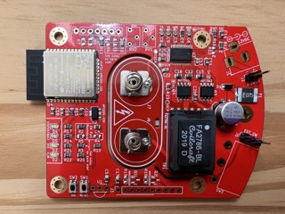

# kbx's Neon Power Supply with ESP32 <!-- omit in TOC -->

This repository contains [KiCad](https://kicad.org) project files for a small power supply PCB for tabletop neon (**real** neon...as opposed to LED "neon") figures/sculptures commonly found on [Etsy](https://etsy.com) and [eBay](https://ebay.com).

This turned out to be, without question, the most challenging and educational electronics project I've ever undertaken.

For more images, please see the [gallery](GALLERY.md). I've also posted a short [video](https://youtu.be/dW0gycuDIJ8) of the neon cactus on [YouTube](https://youtube.com).

## Table of Contents  <!-- omit in TOC -->
- [Preface](#preface)
  - [It Begins](#it-begins)
  - [What's Inside?](#whats-inside)
  - [But One Broke...](#but-one-broke)
  - [I Can Do Better](#i-can-do-better)
  - [Making It Happen](#making-it-happen)
  - [Too Late](#too-late)
- [Introduction](#introduction)
  - [High-Voltage Power Supply & Controller](#high-voltage-power-supply--controller)
  - [ESP32 and Related Peripheral Components](#esp32-and-related-peripheral-components)
- [More Details, Please](#more-details-please)
  - [The Important Bits](#the-important-bits)
    - [Tank Circuit](#tank-circuit)
    - [More Tank Circuit...and Voltage Sensing](#more-tank-circuitand-voltage-sensing)
    - [Current Sensing...and More Voltage Sensing](#current-sensingand-more-voltage-sensing)
  - [Setting Expectations](#setting-expectations)
- [ESPHome Configuration](#esphome-configuration)
- [Legal stuff and License](#legal-stuff-and-license)

## Preface

### It Begins

This project came about as I've had three of these little neon sculptures for quite a while (as in, 20+ years):

It's been something I've wanted to do for a while; that said, I'm glad I waited because I needed every bit of (electronics) knowledge I've amassed over the years to complete it (more on that later).

### What's Inside?

Each one of the neon lamps came with a small cylindrical base and inside of each base was one of these PCBs:

The larger of the three (on the right) was the one that was in the base of the cactus. That said, while they're all physically different, they all more or less work in the same way -- a small power transistor is switched by an oscillator (either a 555 timer or a flyback coil from the transformer) at a high frequency (20-30 kHz), consequently "tickling" a coil on a transformer. The transformer steps up the voltage from the low-voltage power supply (12 volts DC) to a much higher voltage (estimated to be around 2 kV) to light the neon tube.

### But One Broke...

The martini glass's inverter board suffered a (very) premature failure just a couple of months after I'd purchased it. I'm not 100% certain but I have very good reason to believe the failure was due to its transformer. I have a number of reasons to believe this; here is one bit of supporting evidence:

Due to the inexpensive (at the time) nature of it, I never pursued any type of replacement as I thought that, someday, it would make a nice little project to repair it. Well, some time later, here we are and...boy was I right about it being a nice _project_!

### I Can Do Better

While I love and very much appreciate neon lighting in general, I found myself not using any of these lights because of the "broken" one and also because they required me to walk over and manually switch them on and off. I'm wayyyyy too lazy to (remember to) do that. Because of this, they got placed on a shelf and largely forgotten about. I tried repeatedly to find a replacement transformer for the damaged board, but this proved to be more or less impossible. The transformers on the original PCBs have no (useful) markings on them and despite that I tried and tried I just couldn't find anything that I was confident would work. One day I realized that, as an electronics hobbyist, instead of fixing the broken board, I could just design my own. Being a bit of a home automation fanatic, I quickly also realized that they'd be way more enjoyable if they could be remotely switched or even dimmed. Last but certainly not least I realized that I knew just how to make this all happen. I just needed to piece together a little puzzle...

### Making It Happen

My goal was to draw up a PCB that would fit into all of the original bases. Given that the bases contained mostly empty space, this wasn't terribly challenging. The original PCB in the cactus's base was designed such that the power jack and switch were positioned to be exposed directly through the back of the base; the other PCBs had their power jack and switch mounted into the base elsewhere and wires were used to attach these to the PCB. As such, the physical layout of the PCB was less important for these.

As you can see in the picture at the top of this section, each length of neon tube is terminated into a small plastic "plug" that slides into a "socket" recessed into the base. All of these are the same size and, on the bottom of the plug, two terminals are exposed. These contact spring terminals when the neon is inserted into the base -- hence the two spring terminals (surprise -- they're battery contacts!) you see in the middle of the PCBs I designed.

It turns out that the physical design and layout was the easy part...for several reasons...

Physical requirements/constraints aside, I also wanted to be able to remotely control and dim the neon lights. Having worked with them quite a bit in other projects, I knew that the [ESP32](https://www.espressif.com/en/products/socs/esp32) was more than sufficiently equipped to accommodate this -- the question was, how do you get a little 3.3-volt microcontroller to control a 2,000-volt power supply? It turns out that it's not terribly difficult...kind of. You just need the right parts and, at least a few years ago, these were pretty common.

After much researching and digging, I learned about ICs known as "CCFL controllers". These parts are specifically designed to manage these types of light sources and to allow control of them via a microcontroller. Neat! I came across the [TPS68000](https://www.ti.com/product/TPS68000) as I was trying to find an appropriately-rated transformer for this application. TI had an evaluation board for the [TPS68000](https://www.ti.com/product/TPS68000) that featured the Coilcraft [FA2786-BL](https://www.coilcraft.com/en-us/products/transformers/power-transformers/ccfl-transformers/fa2786/). I ordered a few of these and began testing them -- they appeared to work great for this application so I moved forward with a design based on the evaluation board for these parts.

### Too Late

Here's the catch -- I'm at least ten years (at the time of this writing) late to taking on this project. You see, right now, LEDs are replacing _every_ other type of light source. Before LEDs could light...anything...discharge lighting (neon, CCFLs, etc.) was much more common...and so were the electronics to make these things work. While none of this is gone completely just yet, it's becoming more and more difficult to find parts to make these types of light sources work with the type of control I wanted.

I had to order the [TPS68000](https://www.ti.com/product/TPS68000) ICs from someone on [eBay](https://ebay.com). They don't appear to be obsolete...yet...but I expect they will be marked as such soon, probably within the next year or two. An alternative might be the [MAX8722C](https://www.maximintegrated.com/en/products/power/MAX8722C.html) as it appears to be quite similar; that said, I haven't tested it, but I did order a few to have on-hand. Side note: the [MAX8722C's](https://www.maximintegrated.com/en/products/power/MAX8722C.html) [reference manual](https://datasheets.maximintegrated.com/en/ds/MAX8722C.pdf) ultimately proved to be _much_ more insightful than the manual for the [TPS68000](https://www.ti.com/product/TPS68000).

The [FA2786-BL](https://www.coilcraft.com/en-us/products/transformers/power-transformers/ccfl-transformers/fa2786/) was only available for purchase directly from Coilcraft; I'm also not convinced it will be produced for much longer. I guess time will tell.

With all of this in mind, I put aside my concerns around designing a board based around soon-to-be-obsolete parts and drew up a schematic and PCB. If I'm going to do this, it needs to be now.

## Introduction

I've designed this circuit to power the neon sculptures shown above. It allows remotely switching and dimming of the neon via the [ESP32](https://www.espressif.com/en/products/socs/esp32); I used this part with [ESPHome](https://esphome.io) in mind for the firmware. It's a perfect fit!

The circuit consists of two main parts:
 - High-voltage power supply & [TPS68000](https://www.ti.com/product/TPS68000) controller
 - [ESP32](https://www.espressif.com/en/products/socs/esp32) and related peripheral components

### High-Voltage Power Supply & Controller

The high-voltage power supply is the heart of this design. Without it, the neon won't light.

As the [TPS68000](https://www.ti.com/product/TPS68000) is the center of this part, the majority of the design comes straight out of its [reference manual](https://www.ti.com/lit/ds/symlink/tps68000.pdf) -- or, more specifically, the manual for the [TPS68000EVM-202 evaluation board](https://www.ti.com/lit/ug/slvu206/slvu206.pdf). That said, the design had to be tuned somewhat to accommodate the characteristics of the longer, larger-diameter neon tubes. More on this later.

### ESP32 and Related Peripheral Components

There's not much to be said about this part -- the board has a footprint for an [ESP32-WROOM](https://www.espressif.com/en/products/modules/esp32)-series module and a few components to support it, such as power and status LEDs, a 3.3-volt regulator and appropriate pull-up/down resistors. There is also a header through which the microcontroler can be flashed with its firmware. Appropriate GPIO pins are connected to the [TPS68000](https://www.ti.com/product/TPS68000) to allow switching on/off of the neon as well as dimming (via the ESP32's DAC and/or PWM). The [TPS68000's](https://www.ti.com/product/TPS68000) `fault` line is also connected so that the ESP32 can be aware of faults on the high-voltage side.

## More Details, Please

As I said earlier, this turned out to be the most challenging and educational electronics project I've ever undertaken. Let's talk about that.

At this point, I've done plenty of work with the [ESP32](https://www.espressif.com/en/products/socs/esp32) -- that wasn't the challenging part. The [TPS68000](https://www.ti.com/product/TPS68000) is by far and away where the challenge came in. Prior to this project, I'd never worked with LC (inductance-capacitance) circuits before; I quickly realized that I had a lot to learn to get this (mostly) right.

I designed a test PCB to try out the suggested full-bridge configuration to drive the transformer. This worked out great as an initial proof-of-concept for the design -- I just wanted to see this work as it wasn't something I had tried before. I wasn't sure about heat, frequency, power draw, etc. and I wanted to get a feel for this before I risked blowing up a now-hard-to-get [TPS68000](https://www.ti.com/product/TPS68000). Once I saw the design working, I moved on to the next step/phase of the design.

The [TPS68000](https://www.ti.com/product/TPS68000) is a clever little IC. I read and felt like I understood its [reference manual](https://www.ti.com/lit/ds/symlink/tps68000.pdf), but until I finally got to physically working with it, I didn't quite realize just what I needed to do. Some of my struggle was due to my lack of experience with tuning feedback circuits, some of it was due to the somewhat different characteristics of the neon tubes (as opposed to a plain CCFL tube).

### The Important Bits

Let's look at some of the speed bumps I encountered as I was working through understanding the various aspects of the design.

#### Tank Circuit

The low-voltage side of the transformer has its coil in series with a capacitor. This forms a series-resonant tank circuit. There are plenty of other sites around the internet to explain these in detail, so I won't go into that here; what's important to know for this application is that the values of the capacitor and inductor (which, in this case, is one of the transformer's coils) define a resonant frequency. We do **not** want the oscillator to be operating _at_ this frequency -- it should be above it, ideally at least two times the resonant frequency. The [TPS68000](https://www.ti.com/product/TPS68000) needs to be configured accordingly.

#### More Tank Circuit...and Voltage Sensing

On the high-voltage side of the transformer, there is a capacitive divider which allows the [TPS68000](https://www.ti.com/product/TPS68000) to sense (and consequently regulate) the voltage there. The values of these two capacitors define both the voltage that the [TPS68000](https://www.ti.com/product/TPS68000) will try to regulate/maintain as well as the parallel-resonant frequency of the circuit; this frequency is important _before_ the (neon) lamp strikes (in other words, when it is nothing more than an open circuit). As the [TPS68000's](https://www.ti.com/product/TPS68000) [reference manual](https://www.ti.com/lit/ds/symlink/tps68000.pdf) mentions, when the controller is enabled, it will start its oscillator at two times the configured frequency. It will sweep the frequency from there down to as low as one-half of the configured frequency as it tries to strike the lamp. What's important here is that it needs to pass through that parallel-resonant frequency in order to produce the maximum possible voltage across the lamp to ensure that it strikes. If the values of these capacitors don't allow that or if the configured frequency isn't quite high enough, the lamp may not strike reliably, if at all.

#### Current Sensing...and More Voltage Sensing

In addition to the frequency-related items described above, voltages that appear on the [TPS68000's](https://www.ti.com/product/TPS68000) `CSEN` and `VSEN` inputs are also critically important. The [reference manual](https://www.ti.com/lit/ds/symlink/tps68000.pdf) contains screen captures from a scope; it doesn't say much about these but they illustrate what the voltages _should_ look like on these inputs. Don't deviate from these -- if the voltage on either pin is too high, the device will either shut down or regulation will suffer, typically resulting in the transformer "whistling". The capacitors that form the voltage divider on the high voltage side as well as the shunt resistors on either side of the coil/lamp _must_ be chosen with extreme care and it should be noted that these may not be the same from lamp to lamp. For example, in general, I've found that neon lamps with a shorter overall tube length typically require a smaller shunt resistor. In addition, for a given pair of values for the capacitors that form the divider, a shorter overall tube length will result in a smaller voltage appearing on `VSEN`. It may or may not be necessary to compensate for this by adjusting the values of these capacitors.

### Setting Expectations

This is not a circuit you can just build on a board and be done with it...unless you were mass-producing them to be used with a single specific (CCFL) lamp. I've pinned down some component values that tend to work well as a starting point, but in this application, I've found that each board I build needs to be tuned to some extent for the lamp it will be paired with.

With that in mind, I can tell you that an oscilloscope is almost definitely necessary to perform this process correctly. It might be possible with a (good) DMM alone but...good luck. If you plan to build one of these, you should also plan to do some post-build tuning of the circuit. Measure at each of the test points I've put on the board and compare them with the scope captures shown in the [reference manual](https://www.ti.com/lit/ds/symlink/tps68000.pdf). If they're more than about a half of a volt off, you probably need to tweak some resistor and/or capacitor values. In some cases, bumping the frequency up or down a bit (by maybe 1 kHz or so) may help. That said, through lots and lots of experimenting I've found frequencies around 35 kHz or so seem to play best with these types of neon tubes coupled with this circuit. Your mileage may vary.

Overall, the math required for the [TPS68000](https://www.ti.com/product/TPS68000) is a bit involved. A calculator alone is not enough -- you really need a [spreadsheet](https://docs.google.com/spreadsheets/d/1VhNCAI64YPz2V6RbbLRd5rNgBKweANUHgwTCD990pUk/edit?usp=sharing) to hash it all out. Mine is a bit messy and probably isn't perfect but nonetheless it was quite helpful as I fine-tuned my boards. If you build one of these boards and use it, I hope it proves helpful for you, too.

If you are particularly interested in more specifics of the circuit's operation and/or related formulas, I highly recommend taking a look at the [MAX8722C's](https://www.maximintegrated.com/en/products/power/MAX8722C.html) [reference manual](https://datasheets.maximintegrated.com/en/ds/MAX8722C.pdf). It is a very similar controller and its manual is easily an order of magnitude better than the [reference manual](https://www.ti.com/lit/ds/symlink/tps68000.pdf) for the [TPS68000](https://www.ti.com/product/TPS68000), at least as it relates to the explanation of the circuit's operation and mathematical models/representations.

## ESPHome Configuration

I've created a separate repository for my [ESPHome](https://esphome.io) [configurations](https://github.com/kbx81/esphome-configs); configurations I'm using with this board for my various neon lamps are located there.

## Legal stuff and License

Everything you see here is provided to you free of charge. You are free to use it however you please within the constraints of the license -- but you do so at your own risk. This circuit produces a high voltage that could be lethal -- you must use extreme care when handling and testing! I accept absolutely no liability if you cause damage to your property, person, or any other hardware you choose to connect to this device.

The circuit schematic, PCB and enclosures found here are licensed under the [Creative Commons Attribution-ShareAlike 4.0 International License](http://creativecommons.org/licenses/by-sa/4.0/).

_Thanks for visiting!_